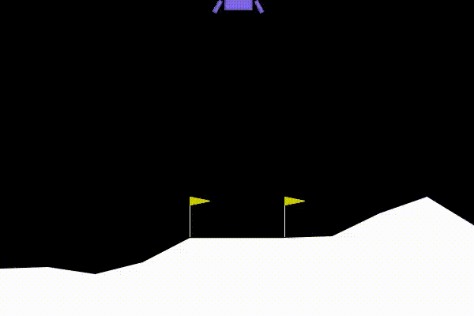

# Repo for misc RL algorithms:

Below is a gif of one evaluation episode in the Lunar Lander v2 environment using my implementation of PPO.

## Maintainer notes:
* Experiments done using `Python 3.11.9` and miniconda env.
* I currently have `gymnasium==0.29.1`. 
    * In the `v1.0` version, `gym.vector.make` will be replaced by `gym.make_vec`. 
    * The current version is still widely supported though, as per gymnasium's docs, so I'll stick to it.

List of algos:
* <a href="./src/bandits/">Bandits</a>.
* <a href="./src/n_step/">N-step Q-learning</a>.
* <a href="./src/model_based/">Dyna-Q</a>.
* <a href="./src/actor_critic/ppo">PPO</a>.
