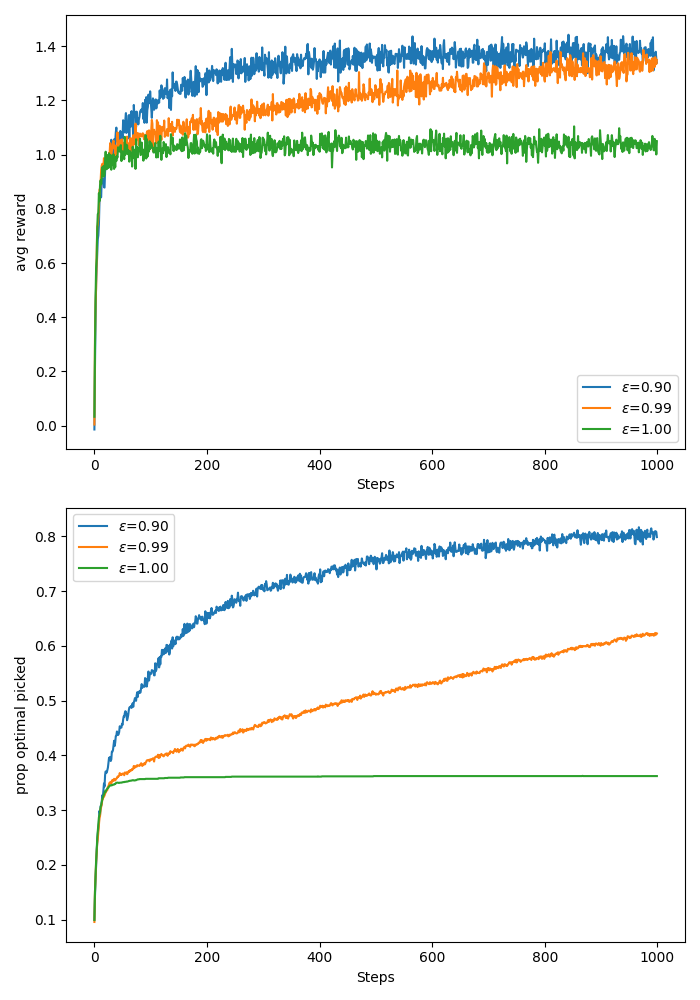
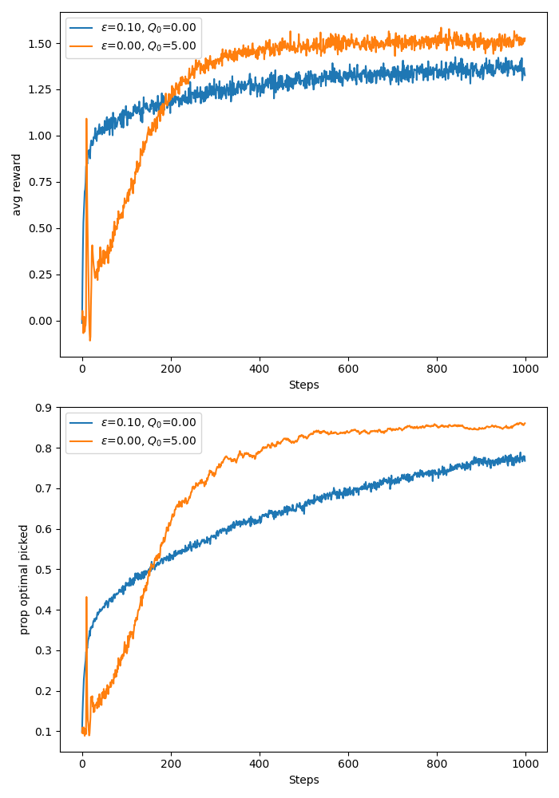

# Notes on bandits:

## Nonassociative case:
> TLDR: 
> * Episodes of length one, always starting in the same state **(only for nonassociative case)**. 
> * Find a behaviour/policy that maximises expected reward over some time horizon, $T$. 
> * The behaviour is usually implicit and based on estimates of usefullness/values of actions. 
> * You have to figure out how to trade of exploitation and exploration so you don't miss out on good actions that have been underexplored. Incorporating uncertainty in your decision-making might prove useful, therefore.
> * Many bandit algorithms resmble value-based RL algorithms.

### Objective:
Find $\pi^*$ such that:

$$
\begin{equation}
    \pi^*=\arg \max_{\pi} \sum_{t=1}^T \mathbb{E}_{A_t\sim \pi} \left[\mathbb{E}[R_t \mid A_t=a_t]\right].
\end{equation}
$$

If I knew $\mathbb{E}[R_t|A_t=a_t]$ for all $a_t\in \mathcal{A}$ and for all $t$, I can just pick the policy $\pi^*$ that implements a greedy operation:

$$
\begin{equation}
    a_t^* = \arg \max_a \mathbb{E}[R_t|A_t=a].
\end{equation}
$$

Since the expectations are unknown, we have to estimate them and potentially use extra heuristics to pick an action.

### Action Value methods:
These are methods only based on estimates (or proxies) of $\mathbb{E}[R_t|A_t=a_t]$ for all $a_t\in \mathcal{A}$. 

No uncertainty is taken into account. To balance exploitation and exploration we forcefully make a uniformly random action selection with probability $\epsilon$. This is known as $\epsilon$-greedy strategy. 

If the estimate of the expectation is the sample average reward for each action, the hope is that if the bandit is stationary, as $T\rightarrow \infty$, we explore each action infinitely often and by the Law of Large Numbers the sample means of rewards per action converge to the true expectations of rewards for each action.

If we have $|\mathcal{A}|$ actions, we pick greedy action/exploit with probability $1-\epsilon + \epsilon \times |\mathcal{A}_t^{\text{greedy}}| / |\mathcal{A}|$. The probability of non-greedy action is $\epsilon \times (|\mathcal{A}| - |\mathcal{A}_t^\text{greedy}|)/ |\mathcal{A}|$,  assuming $\mathcal{A}^\text{greedy}_t\sub \mathcal{A}$ is the set of greedy actions at time $t$.

The action values are usually updated using a version of stochastic gradient descent on the MSE of $\mathbb{E}[(R - Q(A_t))^2\mid A_t]$.
The update is:

$$
\begin{equation}
    Q_{t+1}(a) = Q_t(a) + \alpha_t(a)(R_{t+1} - Q_t(a)),
\end{equation}
$$

where $\alpha_t(a)$ is the learning rate, $a$ was the action taken at time $t$, and $Q_t(a)$ is the estimate of action $a$ at time $t$. This is the same as SGD on the MSE with respect to $Q$, having sampled $R_{t+1}$.

The Robbins-Monro conditions guarantee convergence to the true action values. Therefore, sometimes we get time-varying learning rates that satisfy:

$$
\begin{align}
    \sum_t^\infty \alpha_t(a) &\rightarrow \infty\notag\\
    \sum_t^\infty \alpha_t(a)^2 &< \infty.
\end{align}
$$

Even if the Robbins-Monro conditions are satisfied, however, convergence can be slow and tough to tune a good learning rate decay. Instead we might just opt in for an exponentially moving avg with constant learning rate $\alpha\in (0, 1]$. This is a form of tracking since the relevance of past rewards decays by a factor of $(1-\alpha)$ each time step. And if $\alpha=1$, the action value estimate is the newest reward. This is decent for nonstationary problems and usually works well.

### Ten-arm testbed reproduced:
Here I have reproduced the 10-arm testbed from the Sutton and Barto book. I get the same results, see image below. The code is in <a href="../src/bandits/epsgr_vs_gr.py">here</a>.

### Optimistic initial values:
In order to encourage exploration in the beginning of the experiment we can initialise the action values larger than we expect them to be. This way after trying any action in the beginning the feedback will be disappointing, leading to exploration of the other actions.

This only encourages early stage exploration, however, so is not a remedy for nonstationary problems.

In the figure below I test the usefulness of optimistic initial action value with a greedy algorithm versus epsilon greedy with $\epsilon = 0.1$ and zero initial action value. For the optimistic action value I initialise at 5. This should be optimistic enough since my bandits sample rewards from a Gaussian with standard deviation 1 and mean sampled from a standard Gaussian.

If we use sample averaging as in the previous experiment, the effect of the initial value will be stopped after the first trial of the action. In order to see a prolonged effect of the initial value, I use tracking of action values with constant learning rate of $\alpha = 0.1$ as in the example in the Sutton and Barto book. As we can see, for this problem we made the greedy algorithm explore a lot more in the early stage due to the optimistic initial values and the early stage "disappointment" from the actions. After step 200, however, we see that the greed algorithm begins to outperform the epsilon-greedy strategy in both average reward and proportion of true optimal value picked. The code for this experiment can be found <a href="../src/bandits/optimistic_init.py">here</a>.

