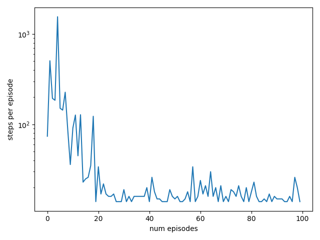
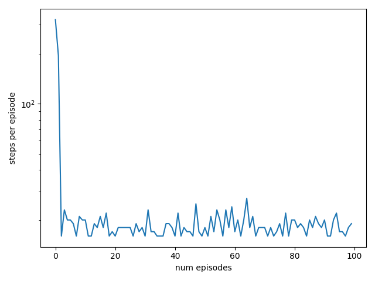
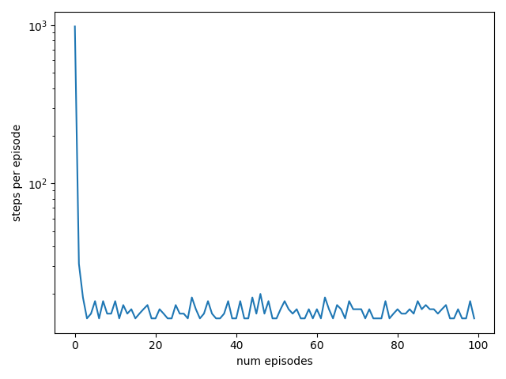

# Dyna-Q

This is a model-based Reinforcement Learining algorithm. In principle all steps can be done in parallel, although here we do a serial implementation as advised in the S-B book.

We interact we the real environment to sample experience, we use direct RL - Q-learning - to update the state-action values, we use the real experience to do model-learning of a sample-model, after which we use the learned model to **simulate** experience and again use the Q-learning update to do planning for $n$ steps. This whole procedure happens for one real experience interaction with the environment.


Pseudocode:

1. For t in range(num-episodes):
    * $S\leftarrow$ env.reset()
    * $A\leftarrow \epsilon$-greedy($S$)
    * terminal = False
    * While not terminal:
        * $S'\,, R\,, terminal\leftarrow$ env.step($A$)
        * Q-learning($Q, S_{sim}, A_{sim}, R_{sim}, S'_{sim}, \alpha, \gamma$)
        * model.update($S\,, A\,, R\,, S'$)
        * For _ in range(n):
            * $S_{sim}, A_{sim}, R_{sim}, S'_{sim}\leftarrow$ model.sample()
            * Q-learning($Q, S_{sim}, A_{sim}, R_{sim}, S'_{sim}, \alpha, \gamma$)
        * $S, A\leftarrow S'$, behaviour.sample($S'$)
2. Return Q

Notice that if we don't plan, $n=0$, we get Q-learning.

## Experiments:
Based on the Sutton and Barto book experiment with DynaQ - the gridworld example. Q values always initialised at 0, rewards are 0 for all transitions except when reaching the goal state. The start is always initialised at (2, 0), the discount is 0.95, the learning rate is 0.1, epsilon is 0.1. In the below ascii diagrams, "." represents a state whose values haven't been updated, the arrows "<, >, v, ^" correspond to the actions to go west, east, south and north respectively; "|" corresponds to a wall-state and "G" is the goal. Unless stated explicitly all models train for 100 episodes.

### $n=0$
This is just Q-learning. The code to run the experiment is:

```
$ python model_based/dynaQ.py n_planning=0 seed=0
```

The learned policy is:

```
.  v  .  .  v  .  .  |  G  

v  v  |  >  >  v  .  |  ^  

v  v  |  .  v  >  v  |  ^  

>  v  |  >  >  >  >  >  ^  

^  >  >  ^  <  |  ^  <  ^  

.  >  ^  ^  .  .  .  .  .
```

Evaluating the greedy policy starting at the start state (2, 0) gives:

```
.  .  .  .  .  .  .  |  G  

.  .  |  .  .  .  .  |  ^  

v  .  |  .  .  .  .  |  ^  

>  v  |  >  >  >  >  >  ^  

.  >  >  ^  .  |  .  .  .  

.  .  .  .  .  .  .  .  .
```

This path was found in 20 episodes. The episode length versus episode count plot is given below:




### $n=5$
Here we do 5 planning steps for each real experience step. The algorithm settles on a policy in 3 episodes. Again due to random seeds, this particular seed did not find an optimal policy, but for many of the other tested seeds it does. To execute the experiment:

```
$ python model_based/dynaQ.py n_planning=5 seed=0
```

The learned policy:

```
>  >  >  v  v  v  .  |  G  

>  ^  |  >  v  v  v  |  ^  

^  ^  |  >  >  v  v  |  ^  

^  ^  |  >  >  >  >  >  ^  

^  >  v  ^  .  |  ^  ^  ^  

>  >  >  ^  <  .  .  .  ^
```

The greedy path:

```
.  >  >  v  .  .  .  |  G  

>  ^  |  >  v  .  .  |  ^  

^  .  |  .  >  v  .  |  ^  

.  .  |  .  .  >  >  >  ^  

.  .  .  .  .  |  .  .  .  

.  .  .  .  .  .  .  .  .
```

The episode lengths versus number of episodes plot:




### $n=50$
Here we do 50 planning steps after each real experience step. An optimal policy is found after 4 episodes. The code to run the experiment is:

```
$ python model_based/dynaQ.py n_planning=50 seed=0
```

The learned policy is:

```
>  >  >  v  v  >  v  |  G  

v  ^  |  >  v  >  v  |  ^  

v  v  |  >  v  v  v  |  ^  

v  v  |  >  >  >  >  >  ^  

>  >  >  >  ^  |  ^  >  ^  

^  ^  ^  ^  ^  >  ^  ^  ^
```

The greedy path is:

```
.  .  .  .  .  .  .  |  G  

.  .  |  .  .  .  .  |  ^  

v  .  |  .  .  .  .  |  ^  

v  .  |  .  >  >  >  >  ^  

>  >  >  >  ^  |  .  .  .  

.  .  .  .  .  .  .  .  .
```

The episode lengths versus number of episodes plot is given below:



### Conclusion:
These experiments demonstrate the superior real-experience sample efficiency of model-based algorithms. The best policy was found in 20 episodes with vanilla Q-learning, versus 4 episodes for dyna-Q with 50 planning steps.