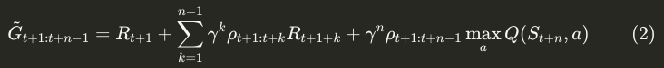
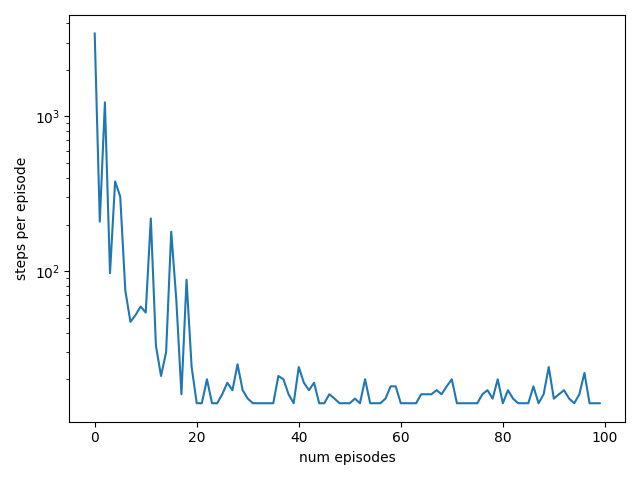

# Implementation of N-step methods.

## N-step Q-learning:
It's an off-policy method, since behaves with exploring policy and evaluates the greedy policy. Below I discuss the per-decision importance sampling version of the algorithm since it should be with lesser variance compared to the vanilla off-policy per-episode importance sampling.

The update:

$$
\begin{equation}
    Q(S_t, A_t) = Q(S_t, A_t) + \alpha (\tilde{G}_{t+1:t+n-1} - Q(S_t, A_t))
\end{equation}
$$





$$
\begin{equation}
	\rho_{i:j}=\prod_{k=i}^j \frac{\pi(A_k\mid S_k)}{\mu(A_k\mid S_k)}.
\end{equation}
$$


In the above, if $S_{t+n}$ is terminal, then we zero out the last term.

Since $\pi$ is the greedy policy, the importance weights can be $0$ if the action selected by the behaviour, $\mu$, is not the greedy action under $\pi$. This can lead to ignoring the entire episode from some point onwards. To deal with this I lower bound the weights:

$$
\begin{equation}
    \tilde{\rho}=\text{max}(\rho, 10^{-8})
\end{equation}
$$

to avoid division by zero errors in the incremental implementation of the algorithm. This also has the interpretation that these trajectories are still pretty unlikely under $\pi$.

Based on the update above, the first $n-1$ steps we don't make updates since we wait to get $n$ rewards. These updates are actually compensated for after the episode terminates, and for each consecutive update we pop the earliest reward based on the previous update in FIFO fashion (queue). So if we want to implement n-step algorithms and assuming the termination of the algo, at time $T$, does not occurr before the $n^\text{th}$ time step, we make a total of $T+n-1$ steps (sampling and/or updating) per episode.

As $n$ grows, in principle we learn faster since the reward signal from the terminal state is used to update $n$ state-action pairs. This is consistent with my experiments.

### Double learning - TODO:

Finally, since in Q-learning policy evaluation overlaps with policy improvement, it is possible to get maximisation bias. This can be fixed by doing double learning - using two value functions. Then we alternate updates in which we move the value at a state-action pair of one function towards the value of the other function at that same pair. The action selection is done according to the first function. 

Intuitively, you are updating your beliefs about your favourite action, $A_t$, at $S_t$ to be more similar to what your friend thinks of selecting $A_t$ at $S_t$. Intuitively, this mimics the information transfer when talking to friends - e.g., when debating which sushi place is the best in your area.

Mathematically, given two value functions $Q_1$ and $Q_2$, the $n=1$ update for $Q_1$ is:

$$
\begin{equation}
    Q_1(S_t, A_t) = Q_1(S_t, A_t) + \alpha [R_{t+1} + \gamma Q_2(S_{t+1}, \arg \max_a Q_1(S_{t+1}, a)) - Q_1(S_t, A_t)]
\end{equation}
$$

and then you alternate this and the analogous version for $Q_2$, e.g. by sampling from $Bernoulli(0.5)$ distribution.


### Experiments:
Based on the Sutton and Barto book experiment with DynaQ - the gridworld example. Q values always initialised at 0, rewards are 0 for all transitions except when reaching the goal state. The start is always initialised at (2, 0), the discount is 0.95, the learning rate is 0.1, epsilon is 0.1. In the below ascii diagrams, "." represents a state whose values haven't been updated, the arrows "<, >, v, ^" correspond to the actions to go west, east, south and north respectively; "|" corresponds to a wall-state and "G" is the goal. Unless stated explicitly all models train for 100 episodes.

#### $n=1$
This corresponds to vanilla Q-learning. The code to do the experiment is:

```bash
$ python n_step/n_step_qlearning.py num_steps=1 seed=0
```

The learned greedy policy is:

```
.  .  .  .  .  .  .  |  G  

v  .  |  v  <  .  .  |  ^  

v  <  |  v  .  v  v  |  ^  

v  <  |  >  >  >  >  >  ^  

>  >  >  ^  ^  |  ^  ^  <  

>  ^  ^  <  .  >  >  ^  .
```

Evaluating the policy with start at (2, 0) we get:

```
.  .  .  .  .  .  .  |  G  

.  .  |  .  .  .  .  |  ^  

v  .  |  .  .  .  .  |  ^  

v  .  |  >  >  >  >  >  ^  

>  >  >  ^  .  |  .  .  .  

.  .  .  .  .  .  .  .  .
```

Similar to the experiments in the book, 1-step Q-learning settles on an optimal policy after 21 episodes. Note that, different seeds may change the final found path, with `seed=0` it happened to find an optimal path, but since the Q-learning guarantees are asymptotic in general, we cannot guarantee convergence to the optimal policy in finite number of steps.

The episode length vs number of episodes plot is:




#### $n=10$
This is the 10 step Q-learning algorithm invoked with:

```bash
$ python n_step/n_step_qlearning.py num_steps=10 seed=0
```

The learned policy is:

```
>  >  >  v  v  .  .  |  G  

^  <  |  v  v  v  <  |  ^  

^  v  |  >  >  v  <  |  ^  

^  <  |  ^  >  >  >  >  ^  

>  ^  <  v  <  |  ^  <  <  

>  >  >  >  >  >  >  ^  .
```

Here we see that more state were esxplored and had their values updated. The convergence to a path is also quicker, taking only 7 episodes. The path on which the algorithm settled though, is not an optimal path:

```
>  >  >  v  .  .  .  |  G  

^  .  |  v  .  .  .  |  ^  

^  .  |  >  >  v  .  |  ^  

.  .  |  .  .  >  >  >  ^  

.  .  .  .  .  |  .  .  .  

.  .  .  .  .  .  .  .  .
```

The reasons for converging on a wrong path in a finite number of steps can be because:
* We used a finite number of steps and didn't decay the learning rate for Robbins-Monro to hold.
* I lower bounded the importance weights.

Another issue may be with overestimation bias which could, in theory, be fixed by double learning (TODO).

The episode lengths versus number of episodes plot is shown below:

