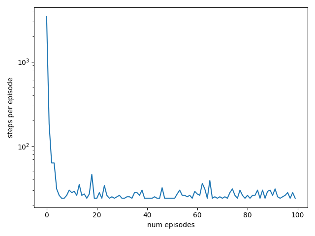

# Implementation of N-step methods.

## N-step Q-learning:
It's an off-policy method, since behaves with exploring policy and evaluates the greedy policy. Below I discuss the per-decision importance sampling version of the algorithm since it should be with lesser variance compared to the vanilla off-policy per-episode importance sampling.

The update:

$
\begin{equation}
    Q(S_t, A_t) = Q(S_t, A_t) + \alpha (\tilde{G}_{t+1:t+n-1} - Q(S_t, A_t))
\end{equation}
$


$
\begin{align}
	\tilde{G}_{t+1:t+n-1} = R_{t+1} 
\end{align}
$


$
\begin{equation}
	\rho_{i:j}=\prod_{k=i}^j \frac{\pi(A_k\mid S_k)}{\mu(A_k\mid S_k)}.
\end{equation}
$


In the above, if $S_{t+n}$ is terminal, then we zero out the last term.

Since $\pi$ is the greedy policy, the importance weights can be $0$ if the action selected by the behaviour, $\mu$, is not the greedy action under $\pi$. This can lead to ignoring the entire episode from some point onwards. To fix this, I used:

$$
\begin{equation}
    \tilde{\rho}_{t:t}=\text{max}(0, 10^{-6})
\end{equation}
$$

to avoid division by zero errors in the incremental implementation of the algorithm. This also has the interpretation that these trajectories are still pretty unlikely under $\pi$.

Based on the update above, the first $n-1$ steps we don't make updates since we wait to get $n$ rewards. These updates are actually compensated for after the episode terminates, and for each consecutive update we pop the earliest reward based on the previous update in FIFO fashion (queue). So if we want to implement n-step algorithms and assuming the termination of the algo, at time $T$, does not occurr before the $n$ time step, we make a total of $T+n-1$ steps (sampling and/or updating) per episode.

As $n$ grows, in principle we learn faster since the reward signal from the terminal state is used to update $n$ state-action pairs. This is consistent with my experiments.

### Double learning:

Finally, since in Q-learning policy evaluation overlaps with policy improvement, it is possible to get maximisation bias. This can be fixed by doing double learning - using two value functions. Then we alternate updates in which we move the value at a state-action pair of one function towards the value of the other function at that same pair. The action selection is done according to the first function. 

Intuitively, you are updating your beliefs about your favourite action, $A_t$, at $S_t$ to be more similar to what your friend thinks of selecting $A_t$ at $S_t$. Intuitively, this mimics the information transfer when talking to friends - e.g., when debating which sushi place is the best in your area.

Mathematically, given two value functions $Q_1$ and $Q_2$, the $n=1$ update for $Q_1$ is:

$$
\begin{equation}
    Q_1(S_t, A_t) = Q_1(S_t, A_t) + \alpha [R_{t+1} + \gamma Q_2(S_{t+1}, \arg \max_a Q_1(S_{t+1}, a)) - Q_1(S_t, A_t)]
\end{equation}
$$

and then you alternate this and the analogous version for $Q_2$.

### Experiments:
We have a 2D gridworld with a wall. Our agent starts in the first column and a random row on at each episode initialisation. The goal is to find the quickest path to the goal which is in the top right corner denoted with, "G". The pipes "|" denote the wall. The arrow heads "<, >, v, ^" correspond to the four directions - west, east, south and north respectively. The state is the current coordinate (row, column). The reward is zero everywhere apart from when reaching the goal.

Below is the learned policy for $n=10$ and $1000$ episodes of learning. The learning rate is $\alpha=0.1$ and the discount is $\gamma=0.9$.

```
>  v  <  <  .  .  .  |  >  G  

v  v  <  ^  <  .  .  |  ^  ^  

>  v  <  .  ^  >  v  |  ^  ^  

>  >  v  v  v  v  <  |  ^  ^  

v  v  v  v  <  v  >  |  ^  ^  

>  >  >  >  >  v  <  |  ^  ^  

>  v  v  v  ^  v  v  |  ^  ^  

v  >  v  v  v  >  >  >  ^  ^  

>  >  >  >  >  >  ^  <  ^  .  

>  ^  ^  ^  <  ^  >  >  ^  <
```

Evaluating the greedy policy when starting at $(4, 0)$ gives:

```
.  .  .  .  .  .  .  |  >  G  

.  .  .  .  .  .  .  |  ^  .  

.  .  .  .  .  .  .  |  ^  .  

.  .  .  .  .  .  .  |  ^  .  

v  .  .  .  .  .  .  |  ^  .  

>  >  >  >  >  v  .  |  ^  .  

.  .  .  .  .  v  .  |  ^  .  

.  .  .  .  .  >  >  >  ^  .  

.  .  .  .  .  .  .  .  .  .  

.  .  .  .  .  .  .  .  .  .
```

which is an optimal path.

The size of the episodes during training is displayed in the image below. Recall that during training we follow the $\epsilon$-greedy behaviour and not the deterministic greedy policy.



The solution with $n=2$ keeping all else the same is slower and some of the paths are not optimal:

```
v  >  v  v  v  v  v  |  >  G  

v  ^  >  v  <  >  v  |  ^  ^  

v  >  ^  v  v  <  <  |  ^  <  

v  v  <  <  <  <  <  |  ^  <  

v  <  v  <  ^  <  <  |  ^  ^  

v  ^  <  v  v  <  >  |  ^  <  

v  v  ^  <  >  <  >  |  ^  <  

v  v  v  v  <  v  v  >  ^  <  

v  v  <  v  v  >  >  >  ^  <  

>  >  >  >  >  >  >  ^  ^  ^
```

For example, when we start at $(4, 0)$, we get:

```
.  .  .  .  .  .  .  |  >  G  

.  .  .  .  .  .  .  |  ^  .  

.  .  .  .  .  .  .  |  ^  .  

.  .  .  .  .  .  .  |  ^  .  

v  .  .  .  .  .  .  |  ^  .  

v  .  .  .  .  .  .  |  ^  .  

v  .  .  .  .  .  .  |  ^  .  

v  .  .  .  .  .  .  .  ^  .  

v  .  .  .  .  .  .  >  ^  .  

>  >  >  >  >  >  >  ^  .  .
```

The episode lengths are:


Learning progress of $n=2$ steps vs $n=10$ steps moving average smoothed lengths over 30 episodes:


